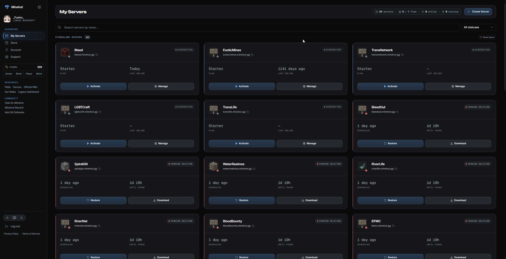
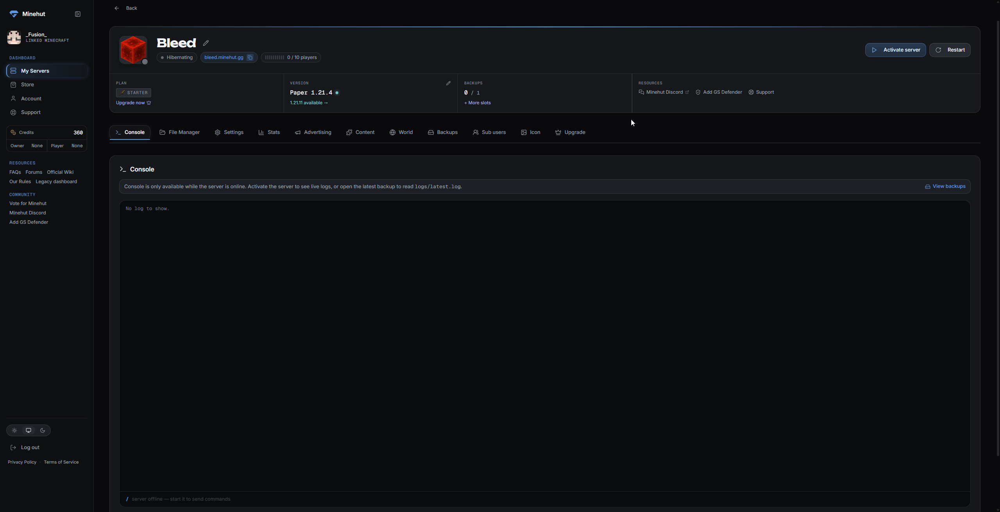

<h1 align="center">Minehut Premium Dashboard</h1>

<p align="center">
  A premium dark theme for <a href="https://dashboard.minehut.com">dashboard.minehut.com</a><br>
  <sub>Warm-neutral OLED surfaces · elevation by measured lightness · one restrained accent · Geist typography</sub>
</p>

<p align="center">
  <a href="https://raw.githubusercontent.com/DaisyCatTs/minehut-premium-dashboard/main/minehut-premium-dashboard.user.css">
    
  </a>
</p>

<p align="center">
  <sub>Needs Stylus first —</sub><br>
  <a href="https://chromewebstore.google.com/detail/stylus/clngdbkpkpeebahjckkjfobafhncgmne">
    
  </a>
  <a href="https://addons.mozilla.org/en-US/firefox/addon/styl-us/">
    
  </a>
  <a href="https://addons.mozilla.org/en-US/android/addon/styl-us/">
    
  </a>
</p>

<p align="center">
  
  
</p>

---

<p align="center">
  
</p>

<p align="center">
  
</p>

---

## Install

**1 · Get Stylus**

| Browser                          | Link                                                                                                                                                      |
| -------------------------------- | --------------------------------------------------------------------------------------------------------------------------------------------------------- |
| Chrome · Brave · Opera · Vivaldi | [Chrome Web Store](https://chromewebstore.google.com/detail/stylus/clngdbkpkpeebahjckkjfobafhncgmne)                                                      |
| Firefox                          | [Firefox Add-ons](https://addons.mozilla.org/en-US/firefox/addon/styl-us/)                                                                                |
| Firefox for Android              | [Add-ons (Android)](https://addons.mozilla.org/en-US/android/addon/styl-us/)                                                                              |
| Edge                             | Install the [Chrome Web Store](https://chromewebstore.google.com/detail/stylus/clngdbkpkpeebahjckkjfobafhncgmne) version — Edge accepts Chrome extensions |
| Safari                           | Stylus is unavailable; use **Cascadea** or **Userscripts**                                                                                                |

Install _Stylus_, not _Stylish_ — [Stylish was pulled from both stores in 2018
for harvesting browsing history](<https://en.wikipedia.org/wiki/Stylish_(software)>).
Stylus is the GPL fork made in response, and collects nothing.

**2 · Add the theme**

Click **Add to Stylus** above, or open the raw link directly:

```
https://raw.githubusercontent.com/DaisyCatTs/minehut-premium-dashboard/main/minehut-premium-dashboard.user.css
```

Stylus recognises the `.user.css` ending and shows an install page. Updates are
automatic afterwards — it polls `@updateURL`.

**3 · Set the site to Dark**

Bottom of the Minehut sidebar: sun / monitor / moon → pick the moon. The theme
styles dark mode only, and as of 2.0.0 it genuinely means that — Light mode is
left as Minehut ships it.

<details>
<summary>Manual install instead</summary>

Stylus icon → **Manage** → **Write new style** → paste the file → **Save**.
The theme carries its own `@-moz-document` domain rule, so leave "Applies to"
alone. No auto-updates this way.
</details>

<details>
<summary>Publishing a fork</summary>

Any URL ending in `.user.css` triggers the install prompt, so a public
[Gist](https://gist.github.com) works as well as a repo. Keep the filename,
point `@updateURL` at your raw URL, and bump `@version` to push an update to
everyone who installed it.
</details>

---

## Settings

The theme has no Stylus settings panel — it carries no `@var` declarations, so
there is no gear icon. Edit the three values in **§02 KNOBS**, at the top of the
file (Stylus icon → **Manage** → the theme → **Edit**).

| Knob          | Default    | Notes                                                                                                    |
| ------------- | ---------- | -------------------------------------------------------------------------------------------------------- |
| `--og-accent` | `#5B93E8`  | Every blue: focus ring, active nav, primary action, card rail, tab underline, selection, console keyword |
| `--og-speed`  | `1`        | Unitless multiplier. `0` disables all motion; `1.5` lands the base step at 270ms, which starts to drag   |
| `--og-radius` | `0.625rem` | Control radius. Drives Minehut's own `rounded-sm/md/lg/xl` plus the sidebar items and server tiles       |

A heavily saturated accent will fight the design: saturated colour on a
near-black ground reads as though it is emitting light. Around 70–75% saturation
stays calm.

The surface ladder is no longer a single knob. It is authored as HSL triplets in
**§03**, because shadcn resolves `hsl(var(--card))` and needs a bare `H S% L%`
triplet — which no CSS function can derive from a colour. Every other token in
the file is derived from that block, so editing a rung there moves everything
that depends on it and nothing can drift out of sync.

---

## Design

**Elevation is lightness.** Shadows are nearly invisible on a dark ground, so
depth comes from a five-rung surface ladder stepped by _measured_ CIE L\* —
2.7 → 5.1 → 8.8 → 12.4 → 16.6 — not by nominal HSL lightness, which is not
perceptually uniform. Hover raises a surface a rung instead of casting.

**Pure neutral.** Zero chroma at every rung. Minehut puts every surface, border
and text token at hue 35–45, which leaves the eye no neutral reference — and
simultaneous contrast then pushes a faintly warm grey all the way to brown on
small uppercase labels. Trimming chroma twice didn't fix it; removing it did.

**Accent is earned.** One blue, spent in three tiers and used about a dozen
times: focus, active navigation, the primary action, the tab underline,
selection. Data, labels and domains stay neutral, so blue always means
something. No glow — a lit indicator is a 3px ring, not a 28px bloom.

**Colour is split by job.** Success, warning and danger take the semantic trio
that reads instantly. Minehut's own material hues stay where they carry
distinctions those three can't: diamond marks a version, amethyst a plugin,
teal an external server.

**Colour carries state.** Emerald running, red pending deletion, amber warning,
teal version. Each status pairs colour with a dot _and_ a label, so it never
depends on colour alone.

**Glass is rare.** Sidebar, overlay panels and the modal scrim — three sites.
`backdrop-filter` is the most expensive filter available and repaints against
whatever scrolls behind it, so it never touches cards or lists.

**Typography is Minehut's own.** Geist Sans for everything, Geist Mono for
metrics with tabular figures, and Unbounded reserved for page titles. All three
are already loaded by the page, so there is no extra request and no flash.
Headings get real leading (1.15–1.35) rather than inheriting body's.

**Measured, not guessed.** Four text tiers at 18.42 / 11.94 / 7.75 / 5.06 : 1
**against the card surface**, evenly spaced at 1.54× per step — every ratio in
the file names the surface it was measured on, and `check-palette.py` fails the
build if a comment disagrees. Focus ring 5.17–7.58 : 1 on all five surfaces.

---

## Troubleshooting

**Nothing changed.** Check the Stylus badge shows a count. If it reads `0`, the
URL didn't match — confirm you're on `dashboard.minehut.com`, not
`app.minehut.com`.

**Page looks light.** The site's own toggle is on Light or System. From 2.0.0
that renders stock Minehut rather than a half-themed page.

**Some pages look plain.** Only **My Servers** and **Console** are visually
verified. 2.0.0 adds coverage for charts, tooltips, dropdown and select items,
dialog internals, data tables, checkboxes and switches, and loading skeletons,
so other routes should hold up — but they are styled from Minehut's shipped CSS,
not from having been looked at.

**Blur looks wrong or scrolls badly.** Enable reduced transparency in your OS
accessibility settings; the theme detects it and switches to solid surfaces.

**Broke after a Minehut update.** Possible, but much less likely than it was.
Token overrides are durable; rules matching Tailwind's generated class strings
(e.g. `rounded-[10px]`, the Monokai hex literals) are not. About a dozen of
those remain, and every one is listed in **§99 ACCEPTED-RISK REGISTER** at the
bottom of the stylesheet with the exact string to search the bundle for. Start
there — `grep '@risk F'` is the whole inventory.

**A control vanished or stopped responding.** Disable the theme to confirm the
cause, then [open an issue](https://github.com/DaisyCatTs/minehut-premium-dashboard/issues)
with the element's HTML.

**Everything is enormous / the whole theme stopped applying.** The stylesheet
uses CSS nesting, which needs Chrome 112+ or Firefox 117+.

---

## Upgrading from 1.x

**Light mode changes.** Until 2.0.0 the theme was not actually scoped to dark —
the palette sat in `:root` and roughly 200 component rules were ungated, so
switching Minehut to Light produced dark cards on light tokens. 2.0.0 gates
everything, so Light mode now looks like stock Minehut. That is the fix, not a
regression.

**Surfaces shift slightly.** 1.x maintained two parallel colour ladders by hand
and they had drifted up to 5.8 percentage points apart. 2.0.0 derives one from
the other, so a few surfaces land where they were always meant to.

**Custom forks break.** The `--og-*` colour ladder is gone; those values are
derived from the shadcn tokens now. If you forked and retinted `--og-s1`…`--og-s4`,
edit **§03** instead.

---

## Files

| File                                 | Purpose                                                                   |
| ------------------------------------ | ------------------------------------------------------------------------- |
| `minehut-premium-dashboard.user.css` | The theme. §01 is the contract — read it before editing                   |
| `Theme guide.md`                     | The design brief the theme is written against                             |
| `tools/`                             | The verification gate, since there's no build step. See `tools/README.md` |

---

## Contributing

PRs welcome. The stylesheet is one file, organised into numbered sections
(`§02 KNOBS`, `§30 CARD`, …) — `Ctrl-F` for `§30` is a single hit, and **§01 is
the contract**: it explains the dark gate, the `!important` policy, the fragility
markers, and a step-by-step **ADDING A RULE** checklist. Read that first; it will
save you the two mistakes that account for most of this file's history.

The short version of both:

1. **Prefer a token over a selector.** Claiming `--border` recolours every
   bordered element in the app with no selector at all.
2. **Verify a hook in the DOM, not just in Minehut's CSS.** A whole section here
   once targeted `.mh-tabs` — which is compiled into their stylesheet and appears
   _zero_ times on the page it was written for.

Before opening a PR, run the gate — there is no build step, so this is it:

```sh
npm run check       # all four gates
npm run format      # prettier — everything EXCEPT the stylesheet, see below
npm run fixture     # then open tools/fixture.html
```

**The stylesheet is excluded from prettier on purpose.** It selects on escaped
Tailwind classes containing CSS hex escapes (`c `), where the trailing space
terminates the escape and is part of the token. Prettier wraps the line there,
consumes the space as a newline, and silently turns one class selector into a
descendant combinator. `check-exact-classes.py` catches it, but the file is
hand-formatted and machine-checked instead.

Then render it locally — no Minehut account required:

```sh
node tools/build-fixture.js && open tools/fixture.html
```

That inlines Minehut's shipped CSS and rebuilds real captured markup, so you can
see the change. Check **light mode** too (remove `class="dark"` from `<html>`):
the theme is scoped to dark, and light must stay stock Minehut.

If you're changing a colour, don't hand-write a contrast ratio —
`check-palette.py` recomputes every one and fails on any comment that disagrees
with its shipped value.

Not affiliated with Minehut.
