<h1 align="center">Minehut Premium Dashboard</h1>

<p align="center">
  A premium dark theme for <a href="https://dashboard.minehut.com">dashboard.minehut.com</a><br>
  <sub>Pure-neutral OLED surfaces · elevation by measured lightness · twelve accents · Geist typography</sub>
</p>

<p align="center">
  <a href="https://raw.githubusercontent.com/DaisyCatTs/minehut-premium-dashboard/main/minehut-premium-dashboard.user.css">
    
  </a>
</p>

<p align="center">
  <sub><b>Need Stylus first?</b> It's a free extension — grab it for your browser:</sub>
</p>

<p align="center">
  <a href="https://chromewebstore.google.com/detail/stylus/clngdbkpkpeebahjckkjfobafhncgmne">
    
  </a>
  <a href="https://chromewebstore.google.com/detail/stylus/clngdbkpkpeebahjckkjfobafhncgmne">
    
  </a>
  <a href="https://addons.mozilla.org/en-US/firefox/addon/styl-us/">
    
  </a>
  <a href="https://addons.mozilla.org/en-US/android/addon/styl-us/">
    
  </a>
</p>

<p align="center">
  <sub>Brave · Opera · Vivaldi → use the Chrome button &nbsp;·&nbsp; <a href="#install--3-steps-about-a-minute">full step-by-step ↓</a></sub>
</p>

<p align="center">
  
  
  
</p>

<p align="center">
  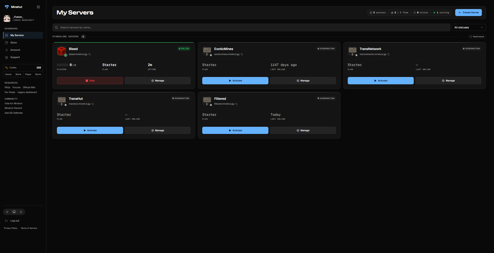
</p>

<p align="center">
  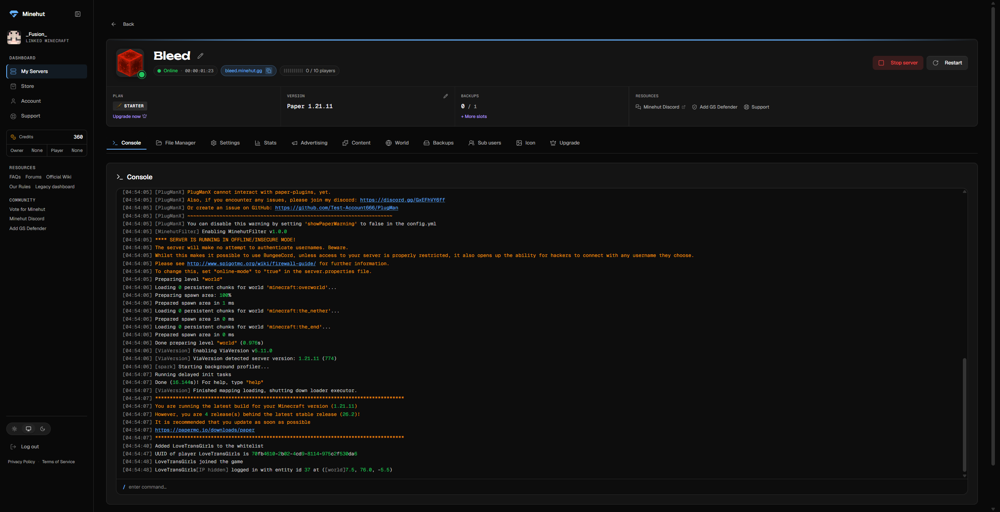
</p>

---

# Install — 3 steps, about a minute

New to this? You only need two things: a free browser add-on called **Stylus**,
and then one click to add the theme. No account, no payment, nothing to download.

## Step 1 — Install Stylus

Stylus is the add-on that lets your browser apply custom themes to websites.
Pick your browser:

<p align="center">
  <a href="https://chromewebstore.google.com/detail/stylus/clngdbkpkpeebahjckkjfobafhncgmne">
    
  </a>
  <a href="https://addons.mozilla.org/en-US/firefox/addon/styl-us/">
    
  </a>
  <a href="https://addons.mozilla.org/en-US/android/addon/styl-us/">
    
  </a>
</p>

| Your browser                                  | What to do                                                                                             |
| --------------------------------------------- | ------------------------------------------------------------------------------------------------------ |
| **Chrome**, **Brave**, **Opera**, **Vivaldi** | Use the Chrome button above                                                                            |
| **Edge**                                      | Use the **Chrome** button above — Edge accepts Chrome extensions                                       |
| **Firefox**                                   | Use the Firefox button above                                                                           |
| **Firefox for Android**                       | Use the Android button above                                                                           |
| **Safari**                                    | Stylus isn't available. Try **Cascadea** or **Userscripts** instead — the theme is not tested on those |

> [!WARNING]
> Install **Stylus**, not **Stylish**. They look similar and are not the same
> thing — [Stylish was pulled from both stores in 2018 for harvesting browsing
> history](<https://en.wikipedia.org/wiki/Stylish_(software)>). Stylus is the
> open-source fork made in response, and collects nothing.

## Step 2 — Add the theme

Click this once Stylus is installed:

<p align="center">
  <a href="https://raw.githubusercontent.com/DaisyCatTs/minehut-premium-dashboard/main/minehut-premium-dashboard.user.css">
    
  </a>
</p>

Stylus will open its own install page. Click the **Install style** button there.
That's it — the theme is on, and it updates itself automatically from then on.

<details>
<summary>The button didn't do anything?</summary>
<br>

Copy this link and paste it into your address bar instead:

```
https://raw.githubusercontent.com/DaisyCatTs/minehut-premium-dashboard/main/minehut-premium-dashboard.user.css
```

Stylus recognises any link ending in `.user.css` and shows the install page. If
you just see a wall of text, Stylus isn't installed yet — go back to Step 1.

</details>

## Step 3 — Turn on dark mode

Go to [dashboard.minehut.com](https://dashboard.minehut.com) and look at the
**bottom of the left sidebar**. There are three little icons — a sun, a monitor
and a moon. **Click the moon.**

This step matters: the theme only styles dark mode. If the page still looks
white, you're on the sun or the monitor icon.

Now refresh the page. Done.

---

# Pick a colour

The theme ships **twelve** accent colours. Blue is the default.

## How to change it

1. Click the **Stylus icon** in your browser toolbar (top-right, next to the
   address bar) while you're on the Minehut dashboard.
2. Find **Minehut Premium Dashboard** in the list, and click the **gear icon**
   next to it.
3. Open the **Accent colour** dropdown and pick one.
4. Click **Save**. ← _don't skip this, the colour won't apply until you do_
5. Refresh the Minehut tab.

> [!TIP]
> If the Stylus icon isn't visible, click the puzzle-piece 🧩 icon in your
> toolbar and pin Stylus so it stays there.

## The twelve

Only the accent moves. Surfaces stay the same dark neutral in every one, and
status colours stay meaningful — green still means running, red still means
stopped.

|                                    <sub>Red</sub>                                     |                                     <sub>Amber</sub>                                      |                                     <sub>Lime</sub>                                     |
| :-----------------------------------------------------------------------------------: | :---------------------------------------------------------------------------------------: | :-------------------------------------------------------------------------------------: |
| 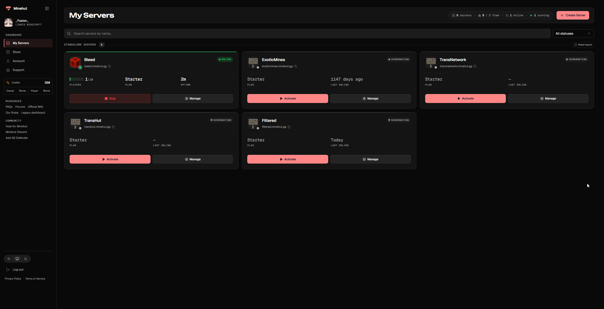 | 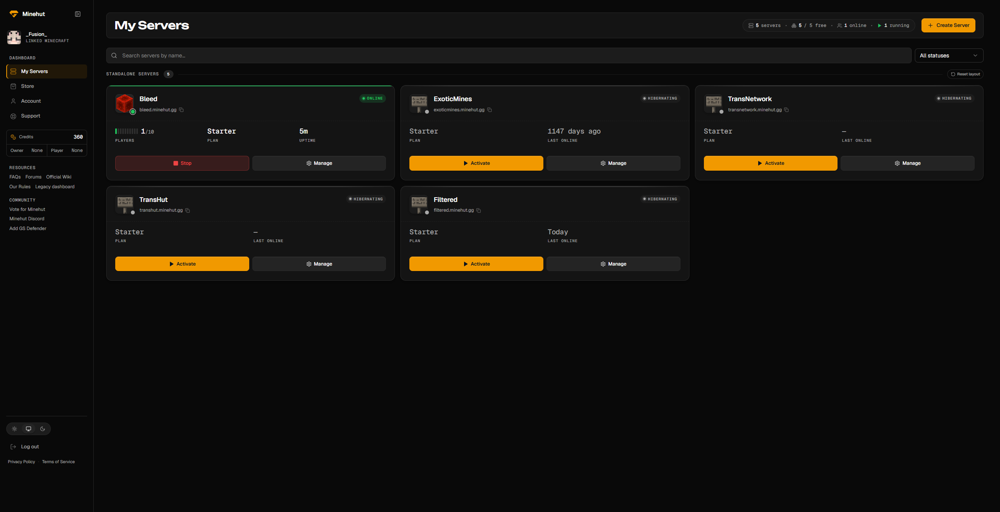 | 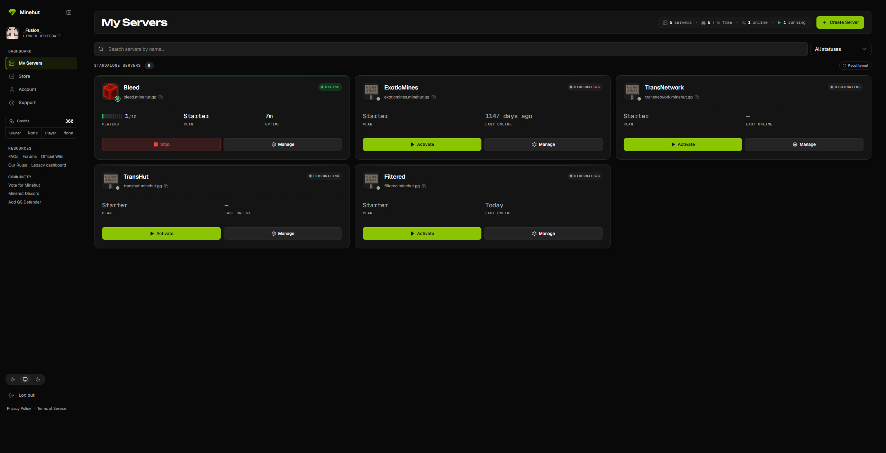 |

|                                      <sub>Emerald</sub>                                       |                                     <sub>Teal</sub>                                     |                                     <sub>Cyan</sub>                                     |
| :-------------------------------------------------------------------------------------------: | :-------------------------------------------------------------------------------------: | :-------------------------------------------------------------------------------------: |
| 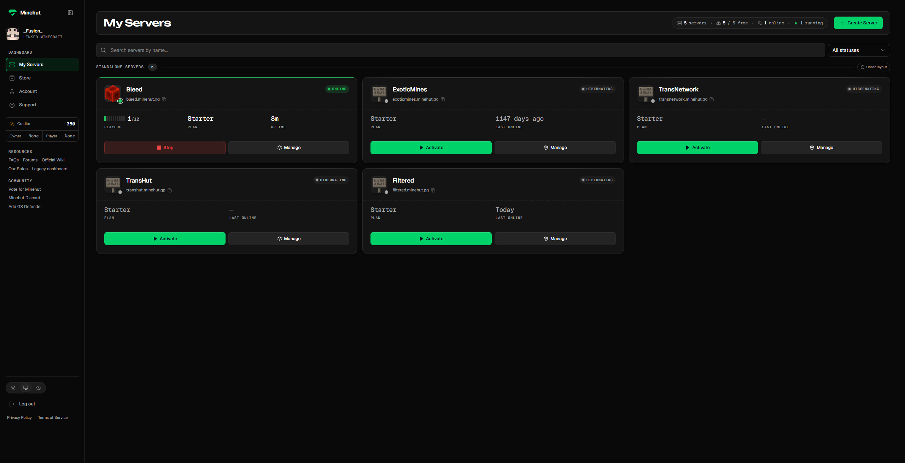 |  | 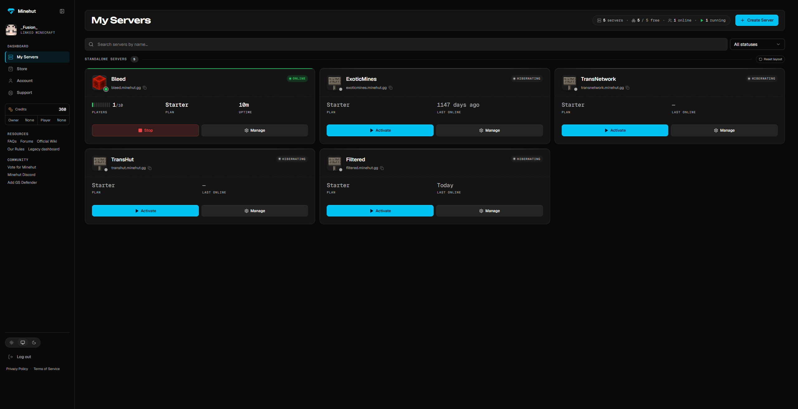 |

|                                <sub>Blue · default</sub>                                |                                      <sub>Indigo</sub>                                      |                                      <sub>Violet</sub>                                      |
| :-------------------------------------------------------------------------------------: | :-----------------------------------------------------------------------------------------: | :-----------------------------------------------------------------------------------------: |
|  | 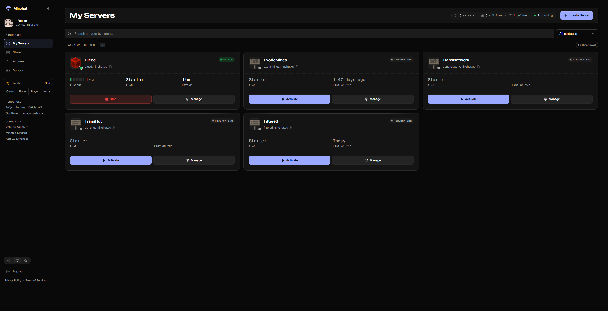 | 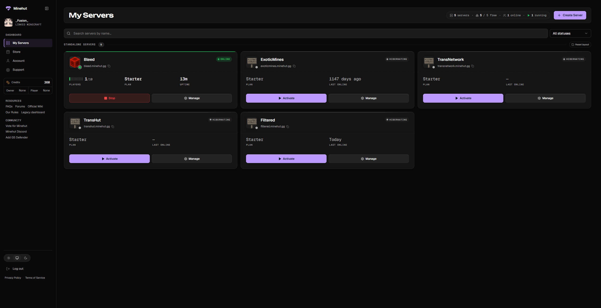 |

|                                      <sub>Purple</sub>                                      |                                      <sub>Fuchsia</sub>                                       |                                     <sub>Rose</sub>                                     |
| :-----------------------------------------------------------------------------------------: | :-------------------------------------------------------------------------------------------: | :-------------------------------------------------------------------------------------: |
| 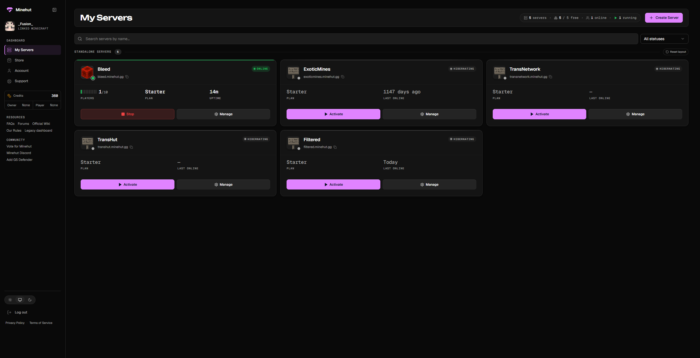 | 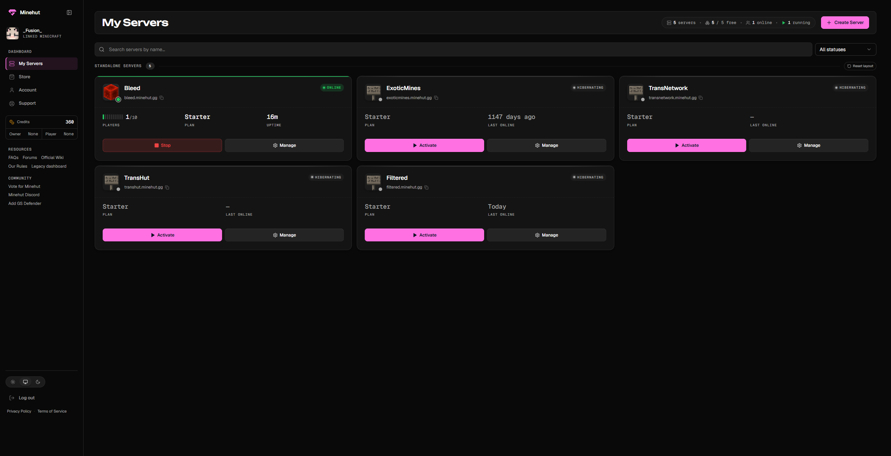 | 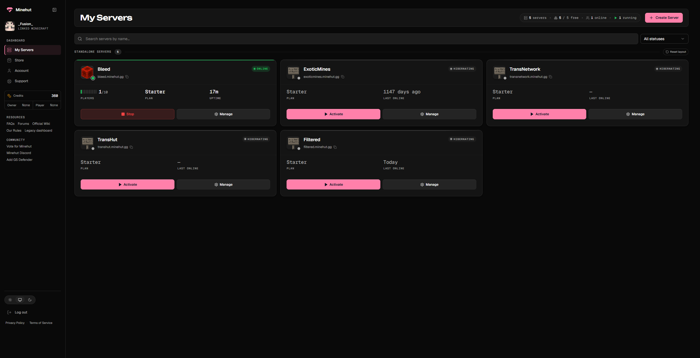 |

<details>
<summary><b>See the console in all twelve</b></summary>
<br>

<p align="center"><sub><b>Red</b></sub><br>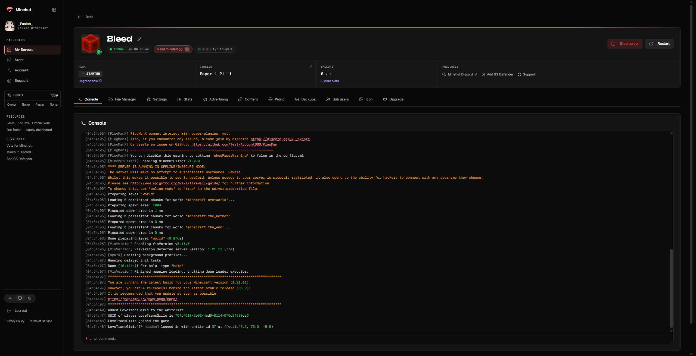</p>
<p align="center"><sub><b>Amber</b></sub><br>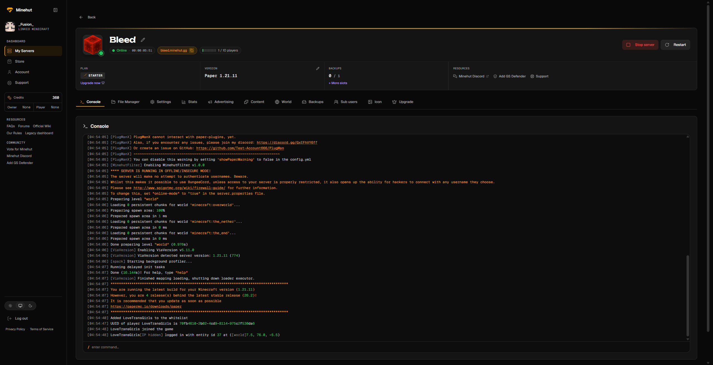</p>
<p align="center"><sub><b>Lime</b></sub><br>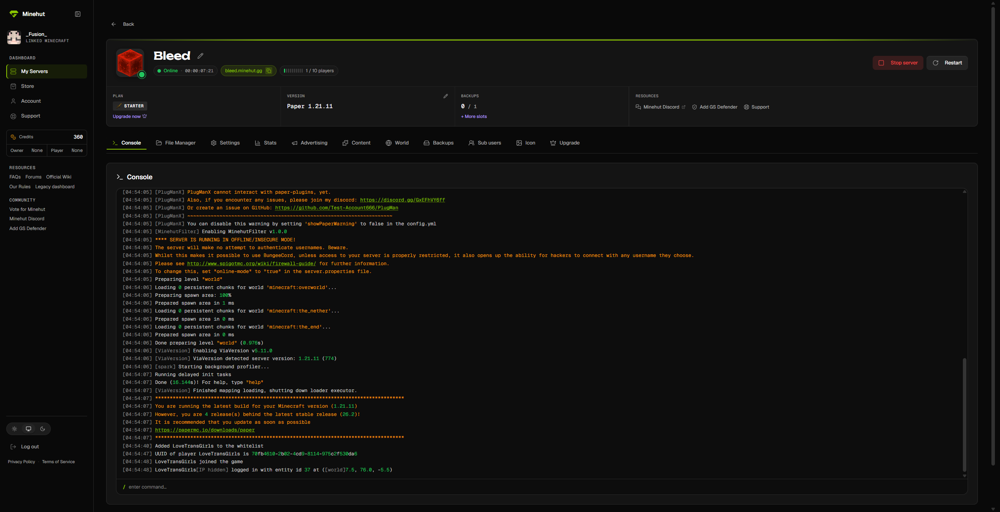</p>
<p align="center"><sub><b>Emerald</b></sub><br>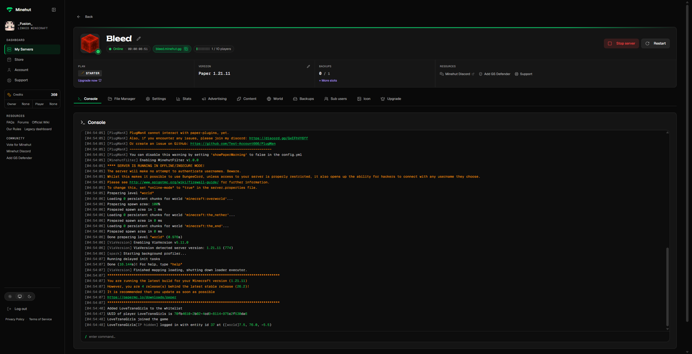</p>
<p align="center"><sub><b>Teal</b></sub><br>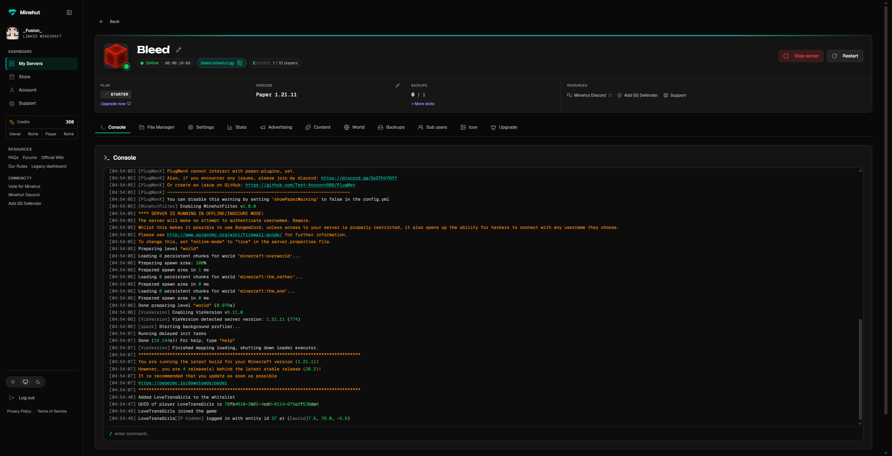</p>
<p align="center"><sub><b>Cyan</b></sub><br>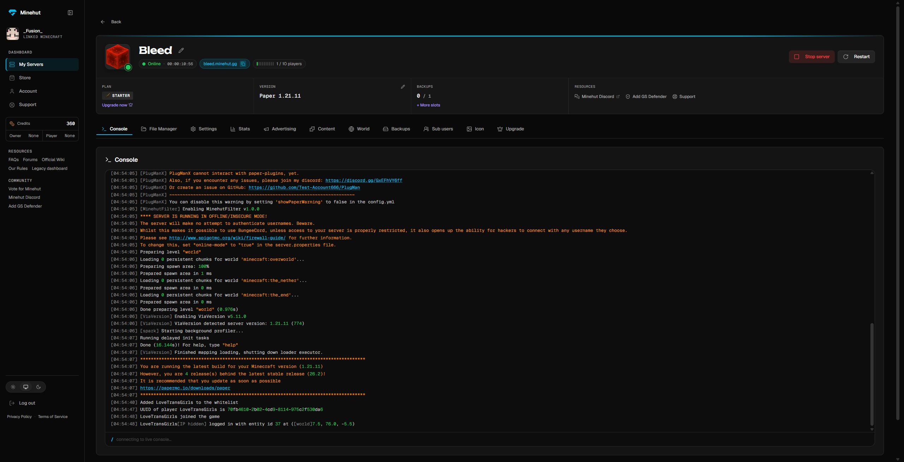</p>
<p align="center"><sub><b>Blue</b></sub><br></p>
<p align="center"><sub><b>Indigo</b></sub><br>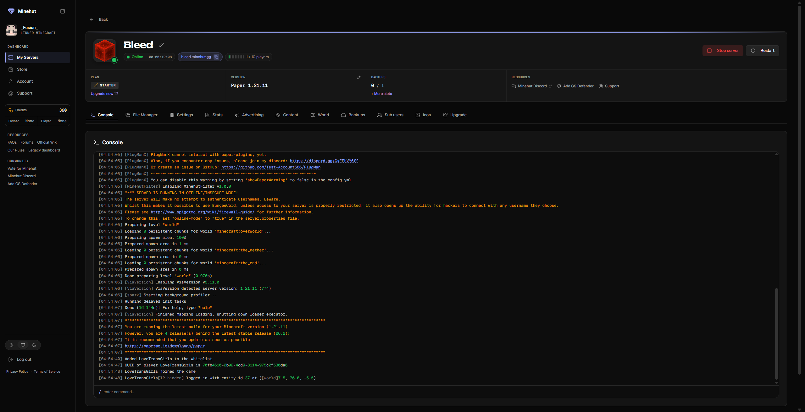</p>
<p align="center"><sub><b>Violet</b></sub><br>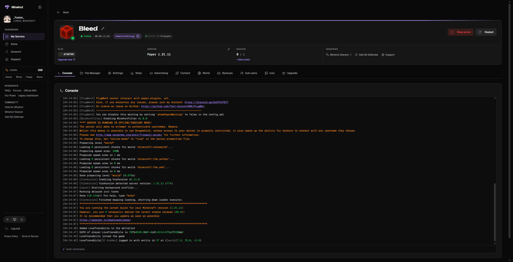</p>
<p align="center"><sub><b>Purple</b></sub><br>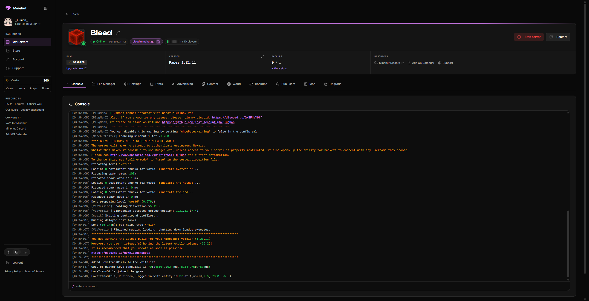</p>
<p align="center"><sub><b>Fuchsia</b></sub><br>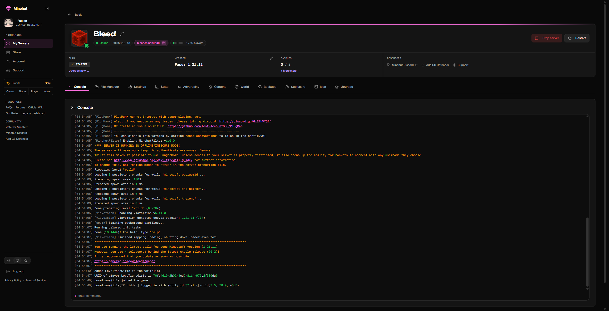</p>
<p align="center"><sub><b>Rose</b></sub><br></p>

</details>

---

# Something's wrong

**The page looks exactly the same.**
Check the Stylus icon shows a small number badge. If it shows `0`, the theme
isn't matching this page — make sure you're on `dashboard.minehut.com` and not
`app.minehut.com` or `minehut.com`.

**The page is white / bright.**
Minehut's own theme toggle is set to Light or System. Bottom of the left
sidebar → click the **moon**. The theme deliberately leaves light mode alone.

**I picked a colour but nothing changed.**
You probably missed the **Save** button in the Stylus settings popup, or the
Minehut tab needs a refresh. Both are easy to miss.

**Some pages look plainer than the screenshots.**
Only **My Servers** and **Console** are visually checked by the author. Other
pages are styled too, but haven't been looked at directly.

**Blur looks weird or scrolling feels heavy.**
Turn on "reduce transparency" in your operating system's accessibility settings.
The theme detects it and switches to solid panels automatically.

**Everything is huge, or the theme suddenly stopped working.**
Your browser is too old. You need Chrome 112+ or Firefox 117+.

**A button disappeared or stopped reacting.**
Turn the theme off to confirm it's the cause, then
[open an issue](https://github.com/DaisyCatTs/minehut-premium-dashboard/issues)
and paste the element's HTML. That's genuinely the most useful thing you can
send — several recent bugs were found exactly this way.

---

<details>
<summary><b>Advanced — extra settings you can edit</b></summary>
<br>

Two more values live in **§02 KNOBS** at the top of the file. To reach them:
Stylus icon → **Manage** → the theme → **Edit**.

| Knob          | Default    | What it does                                                                                             |
| ------------- | ---------- | -------------------------------------------------------------------------------------------------------- |
| `--og-speed`  | `1`        | Animation speed multiplier. `0` disables all motion; `1.5` lands the base step at 270ms, which drags     |
| `--og-radius` | `0.625rem` | How rounded controls are. Drives Minehut's own `rounded-sm/md/lg/xl` plus sidebar items and server tiles |

Hover timing is derived rather than authored: a highlight appears instantly and
fades out over `--og-speed × 150ms`. That asymmetry is what stops rapid pointer
movement strobing.

The surface colours are deliberately **not** a knob. They are authored as HSL
triplets in **§03**, because shadcn resolves `hsl(var(--card))` and needs a bare
`H S% L%` triplet, which no CSS function can derive from a colour. Everything
else in the file derives from that block, so nothing can drift out of sync.

</details>

<details>
<summary><b>The colour system — measured contrast for all twelve</b></summary>
<br>

|                                                                       | Accent               | Hex       | On `--card` | As focus ring | Dark ink on it |
| :-------------------------------------------------------------------: | -------------------- | --------- | ----------- | ------------- | -------------- |
|  | **Red**              | `#FF8686` | 7.90 : 1    | 5.82 : 1      | 8.10 : 1       |
|  | **Amber**            | `#F19900` | 8.16 : 1    | 6.01 : 1      | 8.36 : 1       |
|  | **Lime**             | `#8AC500` | 8.83 : 1    | 6.51 : 1      | 9.05 : 1       |
|  | **Emerald**          | `#00D269` | 9.14 : 1    | 6.74 : 1      | 9.37 : 1       |
|  | **Teal**             | `#00CBB0` | 8.92 : 1    | 6.58 : 1      | 9.14 : 1       |
|  | **Cyan**             | `#00C1F2` | 8.69 : 1    | 6.41 : 1      | 8.91 : 1       |
|  | **Blue** _(default)_ | `#65B2FF` | 8.22 : 1    | 6.06 : 1      | 8.42 : 1       |
|  | **Indigo**           | `#9BA8FF` | 8.26 : 1    | 6.09 : 1      | 8.47 : 1       |
|  | **Violet**           | `#BB9AFF` | 8.05 : 1    | 5.94 : 1      | 8.25 : 1       |
|  | **Purple**           | `#E083FF` | 7.77 : 1    | 5.73 : 1      | 7.96 : 1       |
|  | **Fuchsia**          | `#FF70E2` | 7.60 : 1    | 5.61 : 1      | 7.79 : 1       |
|  | **Rose**             | `#FF80AA` | 7.83 : 1    | 5.77 : 1      | 8.02 : 1       |

The floor is **7.60 : 1** on the card surface and **5.61 : 1** for the focus
ring, against WCAG minima of 4.5 and 3.0 — so no preset is a compromise, and
switching accent cannot make the interface harder to read. Every number here is
recomputed from the shipped file by `tools/check-palette.py`, which fails if a
single one disagrees.

**They are a system, not colours picked one at a time.** Each is solved for the
same perceptual lightness — OKLCH L 0.746–0.756 against a 0.755 target — at the
highest saturation that still reaches it. Every accent therefore carries the same
visual _weight_: switching changes the hue, not how loud the interface is.

**The spread is the point.** Until 4.7.0 there were eight, and three of them —
indigo, violet and purple — sat inside a 37° band and were barely distinguishable
from one another, while 33° to 156° was a 123° hole with no red, no orange, no
lime, no green and no teal. Half the colour wheel was missing and a quarter of it
was served three times. The twelve are spread 18–40° apart with no
near-duplicates, so every entry in the list is a genuinely different choice.

Equal _contrast_ would have been the wrong target. Forcing an intrinsically light
hue down to a blue's luminance turns amber into a muddy olive — that set was
generated and rejected. Equalising perceptual lightness is what Linear moved to
LCH for: a red and a yellow at the same lightness should look equally light.

</details>

<details>
<summary><b>Design principles</b></summary>
<br>

**Elevation is lightness.** Shadows are nearly invisible on a dark ground, so
depth comes from a five-rung surface ladder stepped by _measured_ CIE L\* —
2.5 → 6.3 → 10.3 → 14.2 → 18.9 — not by nominal HSL lightness, which is not
perceptually uniform. Hover raises a surface a rung instead of casting.

**Pure neutral.** Zero chroma at every rung. Minehut puts every surface, border
and text token at hue 35–45, which leaves the eye no neutral reference — and
simultaneous contrast then pushes a faintly warm grey all the way to brown on
small uppercase labels. Trimming chroma twice didn't fix it; removing it did.

**Accent is earned.** One hue, spent in three tiers and used about a dozen times:
focus, active navigation, the primary action, the tab underline, selection. Data,
labels and domains stay neutral, so the accent always means something. No glow —
a lit indicator is a 3px ring, not a 28px bloom.

**Colour is split by job.** Success, warning and danger take the semantic trio
that reads instantly. Minehut's own material hues stay where they carry
distinctions those three can't: diamond marks a version, amethyst a plugin,
copper an external server. Chart series are fixed and 58° apart at the closest
pair, deliberately independent of the accent — series colour carries data, and
two series must never collide because someone picked emerald.

**Colour carries state.** Each status pairs colour with a dot _and_ a label, so it
never depends on colour alone.

**Glass is rare.** Sidebar, overlay panels and the modal scrim — three sites.
`backdrop-filter` is the most expensive filter available and repaints against
whatever scrolls behind it, so it never touches cards or lists.

**Typography is Minehut's own.** Geist Sans for everything, Geist Mono for metrics
with tabular figures, and Unbounded reserved for page titles. All three are
already loaded by the page, so there is no extra request and no flash. Headings
get real leading (1.15–1.35) rather than inheriting body's.

**Measured, not guessed.** Four text tiers at 18.42 / 11.94 / 7.75 / 5.06 : 1
**against the card surface**, evenly spaced at 1.54× per step — every ratio in the
file names the surface it was measured on, and `check-palette.py` fails the file
if a comment disagrees. Focus ring 6.06–8.88 : 1 across all five surfaces.

</details>

<details>
<summary><b>Upgrading from an older version</b></summary>
<br>

**From 4.6 or earlier — three accents moved.** Indigo, violet and purple were
re-solved onto the even hue spread, so they are noticeably different colours now.
Red, Lime, Teal and Fuchsia are new.

**From 1.x — light mode changes.** Until 2.0.0 the theme was not actually scoped
to dark: the palette sat in `:root` and roughly 200 component rules were ungated,
so switching Minehut to Light produced dark cards on light tokens. Light mode now
looks like stock Minehut. That is the fix, not a regression.

**From 1.x — surfaces shift slightly.** 1.x maintained two parallel colour ladders
by hand and they had drifted up to 5.8 percentage points apart. One is derived
from the other now, so a few surfaces land where they were always meant to.

**Custom forks break.** The `--og-*` colour ladder is gone; those values are
derived from the shadcn tokens now. If you forked and retinted `--og-s1`…`--og-s4`,
edit **§03** instead.

</details>

<details>
<summary><b>Manual install, or publishing a fork</b></summary>
<br>

**Manual install.** Stylus icon → **Manage** → **Write new style** → paste the
file → **Save**. The theme carries its own `@-moz-document` domain rule, so leave
"Applies to" alone. You get no automatic updates this way.

**Publishing a fork.** Any URL ending in `.user.css` triggers the install prompt,
so a public [Gist](https://gist.github.com) works as well as a repo. Keep the
filename, point `@updateURL` at your raw URL, and bump `@version` to push an
update to everyone who installed it.

</details>

<details>
<summary><b>For contributors</b></summary>
<br>

PRs welcome. The stylesheet is one file, organised into numbered sections
(`§02 KNOBS`, `§30 CARD`, …) — `Ctrl-F` for `§30` is a single hit, and **§01 is
the contract**: it explains the dark gate, the `!important` policy, the fragility
markers, and a step-by-step **ADDING A RULE** checklist. Read that first; it will
save you the two mistakes that account for most of this file's history.

The short version of both:

1. **Prefer a token over a selector.** Claiming `--border` recolours every
   bordered element in the app with no selector at all.
2. **Verify a hook in the DOM, not just in Minehut's CSS.** A whole section here
   once targeted `.mh-tabs` — which is compiled into their stylesheet and appears
   _zero_ times on the page it was written for.

There is no build step, so the gates are it:

```sh
npm run check         # structure, selectors, and every contrast claim
npm run check:visual  # renders the theme and checks it — needs playwright
npm run format        # prettier — everything EXCEPT the stylesheet, see below
npm run fixture       # then open tools/fixture.html
```

`check:visual` catches what a static read cannot: that light mode stays stock,
that every value follows the accent, that every interactive element still reacts
to hover and stays legible, and that all twelve accents render with zero contrast
failures. Each of those four exists because a release shipped without it and
broke something.

**The stylesheet is excluded from prettier on purpose.** It selects on escaped
Tailwind classes containing CSS hex escapes, where a trailing space terminates the
escape and is part of the token. Prettier wraps the line there, consumes the space
as a newline, and silently turns one class selector into a descendant combinator.
`check-exact-classes.py` catches it, but the file is hand-formatted and
machine-checked instead.

Render it locally — no Minehut account required:

```sh
node tools/build-fixture.js && open tools/fixture.html
```

That inlines Minehut's shipped CSS and rebuilds real captured markup, so you can
see the change. `--accent Purple` previews another theme.

If you're changing a colour, don't hand-write a contrast ratio —
`check-palette.py` recomputes every one and fails on any comment that disagrees
with its shipped value.

| File                                 | Purpose                                                                   |
| ------------------------------------ | ------------------------------------------------------------------------- |
| `minehut-premium-dashboard.user.css` | The theme. §01 is the contract — read it before editing                   |
| `Theme guide.md`                     | The design brief the theme is written against                             |
| `tools/`                             | The verification gate, since there's no build step. See `tools/README.md` |
| `docs/screenshots/`                  | One folder per accent, each with a My Servers and a Console capture       |

</details>

---

<p align="center">
  <sub>MIT licensed · Not affiliated with Minehut</sub>
</p>
